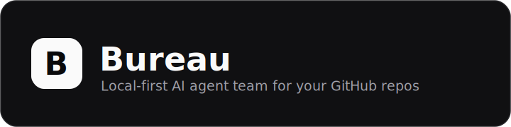
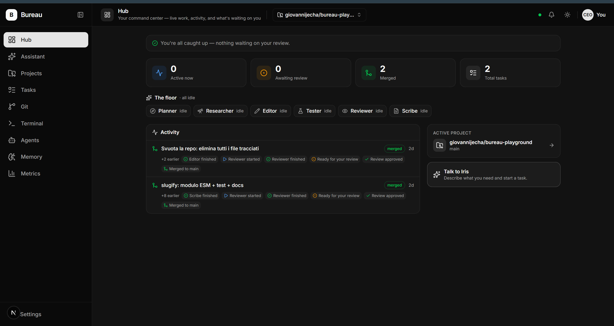
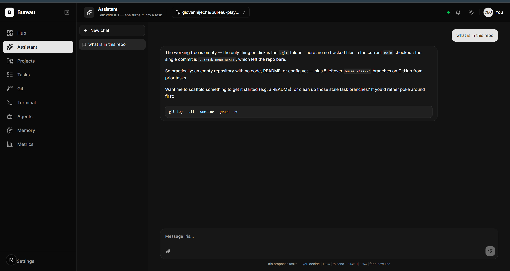
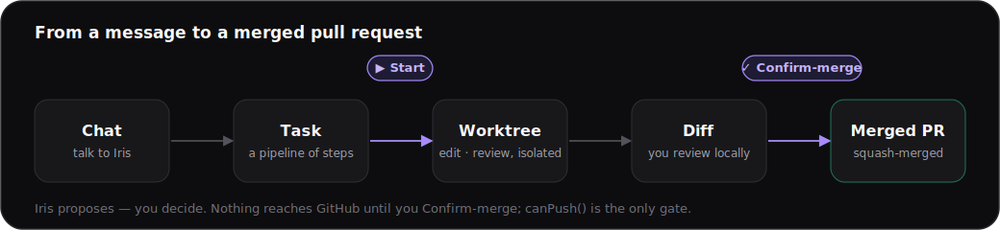
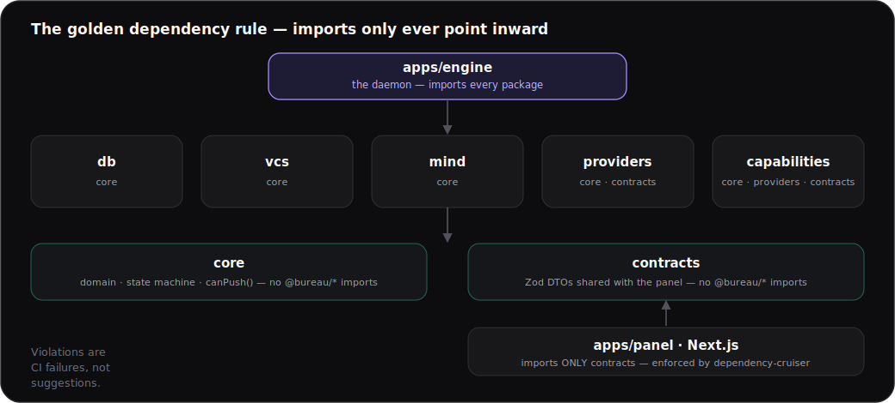

<div align="center">



### Local-first AI agent team that ships **reviewed pull requests** to your own GitHub repos.

[](https://github.com/giovannijecha/bureau/actions/workflows/ci.yml)
[](LICENSE)


[**Quick Start**](#quick-start) · [How it works](#how-it-works) · [Capability workers](#capability-workers) · [Architecture](#architecture) · [Security](#security) · [Contributing](#contributing)

</div>

---

**You don't prompt an agent — you run a firm.** You talk only to **Iris**, the orchestrator. She turns a plain-language request into a durable **Task** and hands it to stateless **capability workers** — plan · research · edit · test · review · document — that do the work in an isolated git worktree. You hold exactly three powers: **Start**, **Stop**, and the final **Confirm-merge**. Nothing reaches GitHub until you approve it, and the whole thing runs on your machine. *State is the truth; agents are replaceable operatives.*

<div align="center">
  
  <br />
  <sub>The <strong>Hub</strong> — your command center: the worker floor, what's merged, and what's waiting on you.</sub>
</div>

> **Safe by construction:** one push gate (`canPush()`), shell-free workers, a loopback-only engine behind an Origin-locked transport, and no secrets at rest. → [Security](#security)

## Quick Start

### Prerequisites

- **Node.js** 20.6+ (the engine auto-loads a local `.env` via `process.loadEnvFile`)
- **pnpm** 9 (`corepack enable && corepack prepare pnpm@9 --activate`)
- **git** and the **GitHub CLI** (`gh`) authenticated against your account (`gh auth login` once)

### Install

```bash
git clone https://github.com/giovannijecha/bureau.git
cd bureau
pnpm install
```

### Build

```bash
pnpm build           # tsc --build across all packages
pnpm typecheck       # type-check without emitting
pnpm lint:boundaries # enforce the golden dependency rule
pnpm test            # run every package's test suite
pnpm quality         # build + boundaries + tests (the merge gate)
```

**CI:** [`.github/workflows/ci.yml`](.github/workflows/ci.yml) runs the quality gate (build + boundaries + tests + panel typecheck) on every push and PR.

### Project layout

```
packages/   core, db, providers, vcs, mind, capabilities, contracts
apps/       engine (Node daemon), panel (Next.js, localhost only)
```

Start with `packages/core/src/task.ts` and `packages/core/src/state-machine.ts` — pure, unit-testable, no dependencies.

### Run

```bash
pnpm build      # compile the engine + packages once
pnpm dev        # starts BOTH the engine (:4319) and the panel (:3000)
```

Open **http://localhost:3000** and **add your first repository from the panel** — Bureau clones it and you're ready. No configuration is required to start: the engine boots with zero projects, the panel onboards you to add one, and the choice persists in a local SQLite DB.

**Provider:** set `ANTHROPIC_API_KEY` to call the API directly; otherwise the engine delegates to the local `claude` CLI.

**Configuring via env (optional).** Prefer to seed repos or run headless? Copy `apps/engine/.env.example` to `apps/engine/.env` (the engine auto-loads it), or export the vars before launching:

```bash
BUREAU_PROJECTS='[{"owner":"you","name":"your-repo","url":"https://github.com/you/your-repo.git","baseBranch":"main"}]' \
BUREAU_GH_PATH="$(command -v gh)" \           # gh must be authenticated (run `gh auth setup-git` once)
BUREAU_AUTHOR_NAME="Bureau" BUREAU_AUTHOR_EMAIL="you@example.com" \
pnpm dev
```

Seeded repos are written to the DB on first launch, after which env is optional (the DB is authoritative — add/remove repos from the panel). Other optional vars: `PORT` (4319), `BUREAU_REPOS_ROOT` (`./.bureau/repos` — where clones + worktrees live), `BUREAU_DB` (`./bureau.db`), `BUREAU_VAULT` (`./bureau-vault` — the System Memory markdown vault), `BUREAU_GIT_PATH`, `BUREAU_TASK_BUDGET_USD` (a per-task cost cap). A single repo can also be configured with the legacy `BUREAU_REPO_OWNER` / `BUREAU_REPO_NAME` / `BUREAU_REPO_URL` (`+ BUREAU_BASE_BRANCH`) vars.

## How it works

You never drive the workers directly — you chat with Iris, and she turns the conversation into durable state that the engine executes in the background. Your decisive powers are exactly three: **Start**, **Stop**, and the final **Confirm-merge**.

<div align="center">
  
  <br />
  <sub>Talking to Iris in the Assistant — she answers, proposes tasks, and stages commands you run with one click.</sub>
</div>

<div align="center">
  
</div>

1. **chat** — you converse with Iris about the active **Project** (one of your repos). The chat is pure conversation — no diffs here.
2. **proposal** — when there's something concrete, Iris proposes a Task: a pipeline of steps. You can **Create** it, **Refine** the proposal, or keep chatting.
3. **Start** — you press Start. The engine runs the pipeline in an isolated git worktree **in the background** (it returns immediately), and the panel streams live progress over a WebSocket — you can walk away.
4. **diff** — a capability worker (e.g. `edit`) makes the change; it is committed **locally** on a branch and **never pushed**. You review the branch in the panel.
5. **confirm-merge** — your final confirmation squash-merges into `main` and deletes the branch. Only here, and only when `canPush()` returns `true`, does anything reach GitHub.

At any point you can **Stop** a running task — it aborts and tears down its worktree, having pushed nothing.

## Projects

One engine serves many repositories. Each repo is a **Project**; you pick the active one in the Assistant (a dropdown) so Iris scopes her proposals and tasks to it. Configure them with `BUREAU_PROJECTS` (see below).

## Capability workers

Stateless operatives that Iris delegates Task steps to. Each is replaceable — all durable context lives in the Task.

| Worker | Persona | Role | Status |
|---|---|---|---|
| `plan` | Planner | Read-only — lay out a concrete implementation plan the edit follows | ✅ Live |
| `research` | Researcher | Read-only — investigate the codebase into a grounded brief the work builds on | ✅ Live |
| `edit` | Editor | Apply a code change directly in an isolated worktree | ✅ Live |
| `document` | Scribe | Update docs / README / changelog for the change | ✅ Live |
| `review` | Reviewer | Read-only — inspect the diff and flag issues before human review | ✅ Live |
| `test` | Tester | Run the project's configured test suite in the worktree (opt-in, advisory) | ✅ Live |

`research`, `edit`, `document`, and `review` are **agentic** — the model works the worktree files directly (confined to that directory; no shell). `edit`/`document` mutate; `research`/`review` are strictly read-only (read tools, no auto-accept) — `review`'s assessment is shown to you at the gate. Iris composes them into a multi-step pipeline (e.g. edit → document → review) that produces one reviewed diff. Workers are registered in the `CapabilityRegistry`; `createTask` refuses any capability that isn't registered, so an unbuilt worker can never silently no-op.

## Architecture

- **Monorepo:** pnpm workspaces + TypeScript project references (no Turborepo)
- **Storage:** SQLite via Drizzle ORM (`better-sqlite3`)
- **Panel:** Next.js App Router, localhost only — never exposed externally
- **Daemon:** Node (`apps/engine`, HTTP + WebSocket)
- **Boundaries:** enforced by dependency-cruiser (violations are CI failures)

### The golden dependency rule

Imports only ever point inward. `core` and `contracts` depend on no other `@bureau/*` package at runtime; `engine` may import everything; `panel` may import only `contracts`.

<div align="center">
  
</div>

## Security

`canPush()` lives in `packages/core` and is the **only** gate before any `push`, `openPr`, or `mergePr`. These three run from exactly one place — the CEO's final confirm-merge — inside an `if (canPush(task))` branch; the background pipeline only ever commits locally. The human gate realized today is `pr_approval` (the diff-review-and-merge confirmation); `plan_review` and `diff_review` are defined in the type system and reserved for later phases. A gate only clears on an explicit human decision — the agent proposes, the human decides.

**Secrets:** the Anthropic API key is supplied via `ANTHROPIC_API_KEY` at launch (or the local `claude` CLI is used instead); GitHub auth is held by `gh` itself. Bureau persists **no** secrets — the database stores tasks, conversations, and the chat, never credentials.

**Workers are shell-free; the `test` worker is the one command-runner.** The agentic workers (`edit`, `document`, `review`) only read/edit files — they have **no shell**. Since no edit tool can delete or rename a file, the `edit` worker requests those in a small `.bureau-ops` manifest, which Bureau applies with Node `fs` (every path confined to the worktree, no shell, no injection surface). The one exception is the **`test`** worker, which runs your project's configured test suite (opt-in, argv-only, no shell). It is therefore **opt-in** (only the per-project `testCommand` you configure ever runs — never anything an LLM, the chat, or a diff could inject), spawned **argv-only with no shell** (metacharacters are inert), confined to the task's worktree, with a timeout + kill and a capped output. Its result is **advisory** — a pass or fail is shown to you at the gate (it never auto-merges, and a failure never blocks or hides the diff), so `canPush()` remains the sole gate. Bureau's own credentials (`ANTHROPIC_API_KEY`, `GH_TOKEN`, `GITHUB_TOKEN`) are stripped from the test process's environment; other env vars are inherited (your test suite runs with the same trust as you running it in your own terminal). Configure it per project: `"testCommand": ["npm","test"]` in `BUREAU_PROJECTS` (or `BUREAU_TEST_COMMAND` for the single-repo path). On Windows, point it at a non-shim binary (e.g. `["node","node_modules/.bin/vitest","run"]`), since `npm`/`pnpm` shims can't be spawned without a shell.

**Transport:** the engine binds `127.0.0.1` only — it is never meant to be reachable off the machine. The `/ws` and `/terminal` WebSockets and the HTTP API share one same-machine `Origin` policy: a cross-site browser tab is rejected, a local client (the panel, or a CLI with no `Origin`) is allowed — closing both Cross-Site WebSocket Hijacking and CSRF against the loopback daemon. Full model and how to report a vulnerability: [`SECURITY.md`](SECURITY.md).

## Roadmap

- **Phase 1–4 — Foundations + vertical slice ✅:** core types, state machine (`transition()` + `canPush()`), DB schema, provider adapters, VCS wrapper; chat → Task → isolated worktree change → diff review → real squash-merged PR on GitHub.
- **Phase 5 — The team + a real cockpit (current) ✅:** the full worker set with multi-step pipelines, streaming chat, and live task progress over WebSocket. The panel covers it end to end — **Assistant**, **Hub** (a live work floor + a "waiting on you" review queue), Projects, Tasks, **Git** (an embedded GitHub browser), **Terminal**, **Memory** (an Obsidian-style vault Iris reads and writes), **Metrics** (real per-worker / -model / -day spend), and **Notifications** — in light or dark. Merge state is honest: a conflicted confirm shows "merge failed" with the PR link, never a false "merged".
- **Next:** parallel-task concurrency and mid-pipeline review gates (`plan_review` / `diff_review`) surfaced in the panel.

## Contributing

Contributions are welcome — code, docs, bug reports, and ideas. Start with [`CONTRIBUTING.md`](CONTRIBUTING.md) for the dev setup and the quality gate (`pnpm quality`), and please read the [Code of Conduct](CODE_OF_CONDUCT.md). The security invariants in [`SECURITY.md`](SECURITY.md) are non-negotiable — a change that weakens any of them won't be merged.

## License

[Apache License 2.0](LICENSE) © 2026 Giovanni Jecha.
